# Foundation Intelligence Platform — AWS Readiness Audit 2026

Audit date: 2026-07-28  
Repository revision: `97d9b02491866edc9b5d1aec1183dc73e2914626`  
Branch: `12-fr-12-add-dashboard-filtering-and-drill-down`

## 1. Audit result

# NO-GO

The application is a credible functional prototype with broad backend test coverage and an internally sound SQLite dataset. It is **not ready to begin an AWS deployment/migration execution** against production data. Architecture and synthetic-data IaC prototyping may proceed, but the public/control plane, data packaging, request concurrency, governance and delivery blockers below must be resolved first.

The strongest positive evidence is:

- 280 backend tests pass with 76.07% measured BFF coverage;
- 8 frontend tests pass; lint and production build complete;
- SQLite `quick_check`/`integrity_check` are `ok`, with zero foreign-key violations;
- dashboard control totals reconcile exactly with SQL;
- staging migration/init is idempotent and a restore copy validates;
- Docker build and both Compose/default-image starts function locally;
- the fully loaded desktop dashboard, map, profiles, Sankey, score, filters and directories are implemented.

The release-blocking evidence is:

- anonymous admin, mutation and generic proxy endpoints would expose data/resource-changing functions if deployed;
- a map call took 67.57 s and caused unrelated calls to wait about 55.44 s because synchronous SQLite work blocks the async server;
- the Docker build sends 8.81 GB and produces a 9.37 GB image containing the 2.10 GB active DB and 1.70 GB registry DB;
- no PostgreSQL implementation, AWS IaC, deployment/rollback pipeline, production auth/RBAC, retention policy or operational SLO/observability exists;
- cold dashboard requests consistently took roughly 28–35 s; the mobile primary view overflows horizontally.

## 2. Critical blockers

| Finding | Severity | Blocker |
|---|---:|---|
| FIP-001 | P0 CRITICAL | Anonymous admin/mutation/proxy surface is unsafe for any public AWS deployment. |
| FIP-002 | P1 HIGH | Synchronous SQLite work blocks the event loop; primary/heavy queries take 28–68 s and serialize users. |
| FIP-003 | P1 HIGH | 9.37 GB root-run image embeds databases and source/processed data. |
| FIP-004 | P1 HIGH | SQLite/filesystem batch architecture is not horizontally safe or PostgreSQL-portable without substantial redesign. |
| FIP-005 | P1 HIGH | No AWS IaC, secure delivery, migration/reconciliation, rollback or production operations gates. |
| FIP-006 | P1 HIGH | Retention/privacy/data-source governance is absent while public/contact data and logs are exposed. |

## 3. System state and audit safety

| Item | Observed state |
|---|---|
| Host | macOS 26.4.1, Darwin 25.4.0, Apple Silicon/arm64, Europe/Berlin. |
| Runtime | Python 3.12.3, Node 22.20.0, npm 10.9.3. |
| Git | Branch ahead of origin by one pre-existing local commit; clean at audit start. No commit/push during audit. |
| Backend | FastAPI development process running on 127.0.0.1:8000 at handoff. |
| Frontend | Vite development process running on 127.0.0.1:5173 at handoff. |
| Active database | `src/data/charities.db`, 2,100,543,488 bytes; audit access was read-only. |
| Staging | Coherent SQLite `.backup` at `/private/tmp/fip-audit-staging-20260728.db`; migration tests only here. |
| Restore evidence | `/private/tmp/fip-audit-restore-20260728.db`, logically validated. |
| Docker | Daemon running; audit containers stopped/removed; 9.37 GB image retained pending approval. |
| AWS | No resource, account action, deployment, push or external write performed. |

No active DB migration, valid admin job, scraper import, enrichment, relink, reset, domain-data deletion or source overwrite was run. Temporary copies were left in `/private/tmp` so evidence remains recoverable until the user approves cleanup.

### Startup and failure-mode matrix

| Scenario | Evidence | Status |
|---|---|---:|
| Frontend dependency install | `npm ci` from lockfile succeeded. | PASS |
| Native Python clean install | Isolated venv created, but package-registry DNS/network was blocked. | NOT TESTABLE |
| Start without Docker | `./start_backend.sh` and Vite dev command start; both endpoints return 200. | PASS |
| Start with Docker | Compose lifecycle and Dockerfile default command return health 200. | PASS |
| Stop/restart processes | Prior dev processes stopped via `Ctrl-C` and restarted; Compose restart/down succeeded. | PASS |
| Full host/OS reboot | Not performed; it would be outside a non-destructive repository audit. | NOT TESTABLE |
| Database init/migration | Idempotent twice on staging only. | PASS |
| Seed/demo data | No separate seed command found; application uses cached/full source data. | NOT IMPLEMENTED |
| Empty cache | Cache-miss/fallback behavior covered in backend tests; fresh browser still showed severe cold latency. | PARTIAL |
| Missing optional environment variables | Default Docker image started without passing source/AI variables; health/read DB worked. Source/AI features require their configured credentials. | PARTIAL |
| Invalid/unavailable downstream configuration | Current fixed core downstream unavailable; proxy returned sanitized 503. Validation tests cover malformed inputs. | PASS |
| Missing/corrupt/locked DB and failed publish | Existing tests use temporary copies and pass; active DB was not damaged to reproduce them. | PASS on staging/tests |
| Missing directories | Pipeline/temp-directory creation and failure paths covered by tests, not by deleting active directories. | PARTIAL |
| Backend port 8000 occupied | Second `./start_backend.sh` exited 3 with `address already in use`; original service stayed healthy. | PASS |
| Frontend port 5173 occupied | `npm run dev -- --strictPort --port 5173` exited 1 with clear error; original service stayed healthy. | PASS |

## 4. Current architecture

### Components

- Frontend: React, Vite, TypeScript/JavaScript, Recharts/map rendering, localStorage favorites/news-run state.
- Backend: FastAPI BFF with 31 OpenAPI paths and 36 operations.
- Persistence: direct synchronous `sqlite3` repository, 2.10 GB single file, JSON-in-TEXT, FTS5 and materialized/cache tables.
- Ingestion: Python CLIs for 360Giving, Charity Commission, Philea, Hinchilla, optional Impressum crawling, curation, enrichment, ECB conversion and cache prewarming.
- Jobs: FastAPI background task launches subprocess commands; status, logs and `O_EXCL` locks are local files; final DB publication is file replacement.
- External services: public source endpoints/RSS, optional Gemini, Anthropic-compatible news summarization and a fixed downstream core API proxy.
- Delivery: backend Dockerfile and development Compose; GitHub Actions unit/coverage/frontend build only.

### Data flow

```mermaid
flowchart LR
    EXT["External sources<br/>360Giving · Charity Commission · Philea · Hinchilla · ECB · News/AI"]:::external
    SCR["Scraper / import<br/>async batch candidate"]:::batch
    VAL["Validation"]:::batch
    RAW["Raw/cache files<br/>LOCAL FS · SPOF"]:::local
    NORM["Normalization"]:::batch
    DEDUP["Deduplication / identity"]:::batch
    ENR["Geo · programme · currency · optional AI enrichment"]:::batch
    STAGE["Staging SQLite<br/>LOCAL FS"]:::localdb
    DB[("Active SQLite 2.10 GB<br/>DB dependency · SPOF")]:::localdb
    API["FastAPI BFF<br/>sync SQLite inside async handlers"]:::sync
    UI["React dashboard"]:::sync
    FILTER["Filters / map / trends"]:::sync
    DRILL["Drill-down"]:::sync
    DETAIL["Profile · grants · Sankey · score · news"]:::sync

    EXT -->|"external network"| SCR
    SCR --> VAL --> RAW --> NORM --> DEDUP --> ENR --> STAGE
    STAGE -->|"validate + atomic file replace"| DB
    DB -->|"synchronous SQL"| API --> UI --> FILTER --> DRILL --> DETAIL

    S3[("AWS candidate: S3 raw/Parquet")]:::aws
    ORCH["AWS candidate: EventBridge + Step Functions"]:::aws
    WORK["AWS candidate: ECS/Fargate workers + SQS/DLQ"]:::aws
    PG[("AWS candidate: RDS PostgreSQL")]:::aws
    SERVE["AWS candidate: ECS API + ALB/API Gateway + OIDC/WAF"]:::aws
    CDN["AWS candidate: S3 frontend + CloudFront"]:::aws

    ORCH -.-> WORK
    EXT -.-> WORK -.-> S3
    S3 -.-> PG
    PG -.-> SERVE -.-> CDN

    classDef external fill:#fff2cc,stroke:#a66d00;
    classDef batch fill:#d9eaf7,stroke:#246;
    classDef local fill:#f8d7da,stroke:#a00;
    classDef localdb fill:#f5c2c7,stroke:#800,stroke-width:2px;
    classDef sync fill:#e2e3e5,stroke:#555;
    classDef aws fill:#d1e7dd,stroke:#175c36,stroke-dasharray:5 3;
```



Synchronous steps are the UI/API/request path. Scraping and enrichment are logically asynchronous batch work but currently run as local processes. Red nodes are local filesystem/database dependencies and single points of failure; green dashed nodes are managed-service candidates.

## 5. Features tested

The complete inventory is in `feature-test-matrix.md`.

| Metric | Count |
|---|---:|
| Identified feature/operation entries | 74 |
| Inspected or exercised | 74 |
| PASS | 32 |
| PARTIAL | 37 |
| FAIL | 4 |
| NOT TESTABLE | 1 |

The one `NOT TESTABLE` feature is the dependency-vulnerability/reproducibility audit: registry/package metadata access was blocked, and the requested escalation was not approved. Docker nevertheless demonstrated that current ranged Python requirements can install in a clean container; it also proved they resolve to different versions than the host, so installation success is not reproducibility.

## 6. Requirements status

Full per-requirement evidence, files, tests, risks, AWS effects and actions are in `requirements-traceability.md`.

### Epics

| EP-00 | EP-01 | EP-02 | EP-03 | EP-04 | EP-05 | EP-06 |
|---|---|---|---|---|---|---|
| PARTIAL | PARTIAL | PARTIAL | PARTIAL | FAIL | FAIL | FAIL |

### Functional requirements

| ID | Status | ID | Status | ID | Status |
|---|---|---|---|---|---|
| FR-01 | PARTIAL | FR-07 | PARTIAL | FR-13 | PASS |
| FR-02 | PARTIAL | FR-08 | PASS | FR-14 | NOT IMPLEMENTED |
| FR-03 | PARTIAL | FR-09 | PASS | FR-15 | NOT IMPLEMENTED |
| FR-04 | PARTIAL | FR-10 | PARTIAL | FR-16 | NOT IMPLEMENTED |
| FR-05 | PARTIAL | FR-11 | PASS | FR-17 | PARTIAL |
| FR-06 | PARTIAL | FR-12 | PARTIAL |  |  |

### Non-functional requirements

| NFR-01 | NFR-02 | NFR-03 | NFR-04 | NFR-05 | NFR-06 | NFR-07 | NFR-08 |
|---|---|---|---|---|---|---|---|
| FAIL | FAIL | PARTIAL | FAIL | FAIL | FAIL | FAIL | PARTIAL |

Totals: 4 PASS, 16 PARTIAL, 9 FAIL, 3 NOT IMPLEMENTED across 32 requirements.

## 7. Findings

### FIP-001 — Anonymous control plane and mutation surface

- **Severity:** P0 CRITICAL.
- **Affected component:** FastAPI admin, funder enrichment/relink/reset/cache, registry enrichment and generic core proxy routes.
- **Description:** The application has no authentication/authorization layer. If reachable publicly, callers can start resource-intensive pipelines, alter matching/enrichment state, populate/reset caches and bridge requests to the configured downstream core.
- **Reproduction:** Inspect OpenAPI; call status/log/proxy without credentials. The unavailable proxy returned a sanitized 503, confirming anonymous reachability. Valid mutation was intentionally not performed on active data.
- **Expected:** Public reads follow policy; every control/write operation requires OIDC identity, least-privilege role and auditable intent. Proxy paths/methods/headers are allowlisted.
- **Actual:** No identity or permission dependency is present. The UI labels a local “Netlight Guest / Administrator” without real authentication.
- **Evidence:** 36 OpenAPI operations; security dependency/middleware inventory; endpoint tests; route code; anonymous local calls.
- **Cause:** Prototype/demo trust model was retained while BFF auth was removed.
- **Impact:** Unauthorized resource use, data-state changes, downstream access and potential security incident.
- **AWS impact:** Absolute public-deployment blocker; WAF alone is insufficient.
- **Recommended solution:** Default-deny writes, separate private admin service/routes, OIDC/Cognito/enterprise SSO, RBAC, path/header allowlist, CSRF/idempotency protection where relevant, audit actor/reason/result.
- **Effort:** Large (2–4 weeks plus identity integration/security review).
- **Dependencies:** Identity provider, role model, downstream core trust policy, threat model.
- **Regression test:** Unauthenticated writes/proxy return 401; wrong role 403; permitted role succeeds with immutable audit event; rate limits and path allowlist enforced.

### FIP-002 — Event-loop blocking and extreme cold/heavy latency

- **Severity:** P1 HIGH.
- **Affected component:** FastAPI handlers, `SQLiteCharityRepository`, overview/map/ranking/search queries.
- **Description:** Async routes execute synchronous SQLite aggregation. Heavy work blocks unrelated requests on the sole event loop.
- **Reproduction:** Call the GBP map with connections while issuing trends/themes/charities/registry/funder requests concurrently.
- **Expected:** Primary views meet an agreed p95 (recommended <=3 s) and one heavy query does not stall health or unrelated reads.
- **Actual:** Map 67.5668 s; peer calls ~55.435 s; fresh dashboard 28–35 s. Warm overview is ~3.24 ms, masking cold behavior.
- **Evidence:** `performance/runtime-measurements.md`, request logs, cold/loading and fully loaded screenshots.
- **Cause:** Request-time full aggregations and blocking `sqlite3` inside async handlers, with incomplete cache coverage.
- **Impact:** Timeouts, unusable UX and no safe concurrency headroom.
- **AWS impact:** Scaling more tasks hides but does not fix the query/event-loop design and raises cost.
- **Recommended solution:** PostgreSQL async pool or explicit worker threads during transition; versioned materialized overview/map/ranking facts; cache; query limits; remove redundant startup fetches.
- **Effort:** Large (3–6 weeks including load tests).
- **Dependencies:** Target data model, SLOs, representative load/dataset.
- **Regression test:** Concurrent load where a worst-case map call cannot push health/read p95 over budget; cold/warm p50/p95/p99 gates.

### FIP-003 — Application image embeds 8+ GB of data and runs as root

- **Severity:** P1 HIGH.
- **Affected component:** `Dockerfile`, build context, Compose.
- **Description:** No `.dockerignore`; `COPY src/` copies active/processed databases and data. Build tools remain in the runtime image; user is root; no image healthcheck/multi-stage/frontend image strategy.
- **Reproduction:** Build with standalone Compose, inspect image/history and list `/app/src/data`.
- **Expected:** Small reproducible data-free image, non-root runtime, healthcheck, pinned dependencies and multi-arch artifacts.
- **Actual:** 8.81 GB context, 9,368,380,422-byte ARM64 image, 2.10 GB active DB and 1.70 GB registry DB embedded.
- **Evidence:** Docker build/history/inspect/run outputs.
- **Cause:** Broad copy and absence of image/data separation.
- **Impact:** Slow builds/pulls, stale/confidential data copies, disk/ECR cost and unsafe runtime permissions.
- **AWS impact:** Blocks acceptable ECR/ECS deployment.
- **Recommended solution:** `.dockerignore`, explicit package/module copy, multi-stage wheels, non-root UID, healthcheck, pinned lock, S3/RDS data, buildx AMD64+ARM64.
- **Effort:** Medium (2–5 days, plus dependency-lock work).
- **Dependencies:** Runtime data-access redesign and artifact policy.
- **Regression test:** CI asserts no `src/data` payload, non-root UID, healthcheck, supported architectures and image-size budget.

### FIP-004 — SQLite/filesystem architecture is not cloud-portable

- **Severity:** P1 HIGH.
- **Affected component:** repositories, schema, pipeline publication, locks/status/logs, FTS/search.
- **Description:** Extensive SQLite dialect/API coupling and single-host filesystem state require a real persistence/job redesign, not a connection-string change.
- **Reproduction:** Static SQL inventory and staging schema/migration analysis.
- **Expected:** Managed transactional store, horizontally safe jobs, durable raw/run state and reversible migrations.
- **Actual:** Direct `sqlite3`, FTS5, pragmas, `INSERT OR REPLACE`, `strftime`, `rowid`, `json_each/extract`, local locks/logs and file replacement.
- **Evidence:** `database-integrity-report.md`; about 111 direct sqlite references and dozens of dialect-specific constructs.
- **Cause:** Optimized local prototype architecture.
- **Impact:** High migration defect risk, inconsistent semantics and single-host operation.
- **AWS impact:** Fundamental data-plane migration blocker.
- **Recommended solution:** RDS PostgreSQL schema/Alembic, versioned loader/reconciliation, S3 raw/Parquet, ECS workers, Step Functions and SQS/DLQ.
- **Effort:** Extra large (6–12+ weeks depending on scope).
- **Dependencies:** Data contracts, retention, performance target and dual-read strategy.
- **Regression test:** Empty/snapshot migration, table/key/FK/control-total reconciliation, golden API diff, search parity, restore and rollback rehearsal.

### FIP-005 — Delivery and operations gates are incomplete

- **Severity:** P1 HIGH.
- **Affected component:** `.github/workflows/ci.yml`, repository infrastructure/operations.
- **Description:** CI runs backend coverage and frontend build only for main/dev. It lacks frontend tests/lint, container, SCA/SAST/secret/IaC scans, DB migration/reconciliation, staging deploy, smoke/load/DAST and rollback.
- **Reproduction:** Inspect the only workflow and search for IaC/deployment configuration.
- **Expected:** Reviewable IaC and protected staged delivery with immutable artifacts, security/data gates and rollback proof.
- **Actual:** No AWS IaC/deploy/rollback workflow or operational runbook.
- **Evidence:** Workflow/config inventory; local verified commands show what can be promoted into CI.
- **Cause:** Delivery has not progressed beyond local/validation CI.
- **Impact:** Unrepeatable deployment, undetected supply-chain/data migration regressions and poor recoverability.
- **AWS impact:** Blocks controlled staging/production delivery.
- **Recommended solution:** Terraform/CDK, GitHub OIDC, environment promotion, SBOM/scans, migration/reconciliation, smoke/E2E/load and rollback jobs.
- **Effort:** Large (3–6 weeks alongside platform foundation).
- **Dependencies:** AWS accounts, IAM/security standards, target architecture and SLOs.
- **Regression test:** Recreate non-prod from IaC; deploy immutable digest; fail a gate; demonstrate automatic/manual rollback and restore.

### FIP-006 — Data governance, privacy and retention are absent

- **Severity:** P1 HIGH.
- **Affected component:** registry/profile data, news/contact extraction, pipeline logs, raw/processed artifacts and exports.
- **Description:** No approved retention schedule, legal/source register, data classification, deletion workflow, privacy review or data-subject process was found. Logs and endpoints can expose addresses/emails/contact evidence.
- **Reproduction:** Inspect schema/artifacts/log samples, admin log endpoint and repository documentation.
- **Expected:** Classified data, lawful/source terms, minimal/redacted logs, lifecycle policy and auditable deletion/hold/restore procedure.
- **Actual:** Indefinite local accumulation and anonymous log access.
- **Evidence:** `data-retention-and-deletion-candidates.md`; source/log/security inventory.
- **Cause:** Governance was not implemented for prototype data flows.
- **Impact:** Compliance/privacy exposure and uncontrolled storage cost.
- **AWS impact:** Blocks production S3/RDS lifecycle and public deployment.
- **Recommended solution:** Source/licence register, DPIA/privacy review, dataset owners, retention/holds, field-level exposure rules, redaction and approved deletion workflow.
- **Effort:** Large and cross-functional (2–6 weeks for baseline, ongoing governance).
- **Dependencies:** Legal/privacy/security and product decisions.
- **Regression test:** Policy-as-code lifecycle review, access tests, log redaction fixtures, deletion dry run plus restore/hold tests.

### FIP-007 — Currency documentation and anomaly cohorts need resolution

- **Severity:** P2 MEDIUM.
- **Affected component:** ECB pipeline, README, grant facts/overview.
- **Description:** Stored/tested conversion uses ECB monthly averages, while README describes daily award-date/previous-business-day behavior. 432 grants lack conversion, two grants are negative and one is future-dated.
- **Reproduction:** Group conversion status/currency and compare API total/README/tests.
- **Expected:** One approved, versioned conversion contract with disclosed exclusions and quality gates.
- **Actual:** Central total is internally correct but documentation semantics differ.
- **Evidence:** Exact SQL/API reconciliation in database report.
- **Cause:** Documentation drift and incomplete rates/source anomalies.
- **Impact:** Analysts can misunderstand totals; future migrations may “correct” behavior inconsistently.
- **AWS impact:** Baseline/reconciliation must freeze the intended metric before cutover.
- **Recommended solution:** Approve conversion policy, fix docs/status naming, quarantine anomalies and add control-total fixtures.
- **Effort:** Small–medium (2–5 days plus business approval).
- **Dependencies:** Product/data owner decision.
- **Regression test:** Currency/date fixture matrix and fixed overview control totals across SQLite/PostgreSQL.

### FIP-008 — Mobile primary view overflows

- **Severity:** P2 MEDIUM.
- **Affected component:** overview header, KPI grid, map mode controls/responsive CSS.
- **Description:** At 390×844, controls/cards extend beyond the viewport and content is cropped.
- **Reproduction:** Fresh headless Chrome screenshot at 390×844.
- **Expected:** No horizontal page overflow; all primary controls accessible.
- **Actual:** Right-hand KPI/control content is off-screen; prolonged loader remains.
- **Evidence:** `screenshots/overview-mobile-390x844.png`; tablet/desktop comparison screenshots.
- **Cause:** Fixed/minimum widths and multi-column layout without mobile collapse/wrap.
- **Impact:** Mobile users cannot reliably use primary features.
- **AWS impact:** CDN deployment does not solve client layout; staging UX gate needed.
- **Recommended solution:** Responsive single-column/cards, scroll-contained map controls and breakpoint tests.
- **Effort:** Medium (2–5 days).
- **Dependencies:** UX acceptance criteria.
- **Regression test:** Playwright screenshots/overflow assertions at 320/390/768/1024/1440 widths.

### FIP-009 — Frontend bundle/fetch/render quality debt

- **Severity:** P2 MEDIUM.
- **Affected component:** React `App`, loading/fetch effects and rendered grant lists.
- **Description:** Main JS is 1.96 MB, lint emits five hook-dependency warnings, runtime logs show repeated duplicate React keys, and fresh views appear to repeat/shared-block startup requests.
- **Reproduction:** `npm run lint/build`, browser runtime logs and fresh-route timings.
- **Expected:** Stable dependency effects, unique keys, bounded chunks and independent loading states.
- **Actual:** Warnings, duplicate-key errors and large main bundle.
- **Evidence:** Build/lint logs and repeated `Awarded to-5Rights Foundation` console errors.
- **Cause:** Large central component/state graph and non-unique display-derived keys.
- **Impact:** Stale/repeated fetches, reconciliation bugs and slower download/parse.
- **AWS impact:** Higher CDN transfer and noisy production behavior.
- **Recommended solution:** Fix dependencies/abort stale requests, use stable IDs, split routes/heavy map/chart dependencies and add console-error E2E gate.
- **Effort:** Medium (1–2 weeks).
- **Dependencies:** UI refactor boundaries and caching strategy.
- **Regression test:** Zero console errors/warnings in E2E, request-count assertions and bundle-size budget.

### FIP-010 — Dependency security/reproducibility is unknown

- **Severity:** P2 MEDIUM.
- **Affected component:** `requirements.txt`, npm dependencies, CI and images.
- **Description:** Python requirements use ranges; host and clean image resolved different FastAPI/Anthropic versions. Vulnerability scanners are absent and registry audit was blocked by the controlled environment.
- **Reproduction:** Compare installed host/container versions; attempt `npm audit` and isolated pip install.
- **Expected:** Locked hashes, SBOM, licence/SCA gates and repeatable build.
- **Actual:** Clean Docker install succeeds but is not version-reproducible; vulnerability status unknown.
- **Evidence:** FastAPI 0.139.2 host vs 0.140.13 image; Anthropic 0.118.0 vs 0.120.2; blocked audit logs.
- **Cause:** Ranged requirements and missing supply-chain pipeline.
- **Impact:** Future builds can change behavior or include unknown vulnerabilities.
- **AWS impact:** ECR artifact cannot be confidently promoted.
- **Recommended solution:** Generate reviewed lock with hashes, Renovate/Dependabot policy, SBOM, SCA/container scan and signed digest.
- **Effort:** Medium (2–5 days initial, ongoing updates).
- **Dependencies:** Network-enabled CI and security policy.
- **Regression test:** Rebuild twice to identical dependency manifest; policy fails on prohibited vulnerability/licence.

### FIP-011 — Health, logs and job observability are not production-grade

- **Severity:** P2 MEDIUM.
- **Affected component:** middleware, `/health`, admin status/log files and jobs.
- **Description:** Health reports process only; logs lack durable correlation/run metrics; status is a local file; no alerts, traces, quality metrics or DLQ.
- **Reproduction:** Call health while inspecting code/status/log formats and concurrency behavior.
- **Expected:** Separate liveness/readiness, request/job IDs, structured metrics, alerts and durable run history.
- **Actual:** Healthy process can be blocked by a query or have unavailable dependencies; logs may expose data.
- **Evidence:** Health 200 normally, queued behavior during heavy request, local status/log files.
- **Cause:** Development-oriented observability.
- **Impact:** Slow detection, incomplete audit trail and weak recovery.
- **AWS impact:** Autoscaling/alarms cannot act on meaningful state.
- **Recommended solution:** DB-aware readiness, structured redacted logs, CloudWatch metrics/alarms, job manifest and SQS DLQ.
- **Effort:** Medium (1–2 weeks).
- **Dependencies:** Target services/SLOs and privacy rules.
- **Regression test:** Inject DB/source/job failures and assert readiness, metrics, alarm and redacted log behavior.

### FIP-012 — Live source completeness, rate policy and legal evidence not verified

- **Severity:** P2 MEDIUM.
- **Affected component:** all scraper/news source integrations.
- **Description:** Mocked retry/pagination/SSRF tests are strong, but no audit-time live full scrape was performed and no approved source/robots/licence register exists. Google News RSS does not prove complete historical pagination.
- **Reproduction:** Review tests/source clients and cached-source distributions; note restricted/no-cost audit boundary.
- **Expected:** Contracted source behavior, legal/politeness policy, freshness SLA and live canary evidence.
- **Actual:** Code/cached data pass; external completeness and current terms remain assumptions.
- **Evidence:** All CLI help exits 0, scraper tests pass, current grants all 360Giving; no live command in command log.
- **Cause:** External/cost/legal constraints and missing formal source governance.
- **Impact:** Silent data gaps or source blocking.
- **AWS impact:** Schedules/quotas/egress cannot be safely finalized.
- **Recommended solution:** Approved source register, low-volume canaries, rate budgets, robots/terms checks and watermark alarms.
- **Effort:** Medium, source-dependent.
- **Dependencies:** Credentials, network, legal approval and source owners.
- **Regression test:** Scheduled canary with schema/checksum/count/freshness assertions and safe retry cap.

### FIP-013 — Schema versioning and FK enforcement are connection-dependent

- **Severity:** P3 LOW.
- **Affected component:** SQLite connections/migrations/metadata.
- **Description:** `PRAGMA user_version=0`, application schema is metadata version 7, and fresh connections default to `foreign_keys=0`.
- **Reproduction:** Read pragmas/metadata on staging.
- **Expected:** One authoritative migration ledger and invariant FK enforcement.
- **Actual:** Application validation succeeds, but enforcement depends on connection setup.
- **Evidence:** Integrity/FK/migration report.
- **Cause:** Application-managed schema history and SQLite defaults.
- **Impact:** A new connection path could bypass FK enforcement.
- **AWS impact:** PostgreSQL will reveal load-order/constraint assumptions.
- **Recommended solution:** Central connection factory assertion now; Alembic ledger and always-on constraints in target.
- **Effort:** Small now, medium as part of migration.
- **Dependencies:** Migration design.
- **Regression test:** Every repository connection asserts FK on; mutation tests fail on orphan insert.

### FIP-014 — Complexity and advisory lint debt raise change risk

- **Severity:** P3 LOW.
- **Affected component:** backend repositories/routes/pipeline and frontend hooks.
- **Description:** Advisory flake8 reports 1,071 findings, including complexity up to 74 and five F811 redefinitions; deprecation warnings are present.
- **Reproduction:** Run full advisory flake8 and tests.
- **Expected:** Maintainable functions with clear lint policy and no ambiguous redefinitions.
- **Actual:** Blocking syntax lint passes and tests pass, but high-complexity hot paths are risky to port.
- **Evidence:** `get_grant_overview` complexity 74; map/repository methods also high; FastAPI/Starlette deprecation warnings.
- **Cause:** Feature growth in central repository/UI modules and advisory-only style policy.
- **Impact:** PostgreSQL/security/performance changes are harder to review and regress.
- **AWS impact:** Increases migration lead time and defect probability.
- **Recommended solution:** Targeted decomposition around data-access/query contracts, remove redefinitions/deprecations, adopt incremental lint baseline.
- **Effort:** Medium–large, phased.
- **Dependencies:** Do after behavior/golden tests, not as broad unaudited rewrite.
- **Regression test:** Complexity/duplicate-definition gate for changed files plus unchanged golden API/data results.

## 8. Entity and provenance separation

- **Donors/source funders:** ranked from observed `fundingOrganization` facts and keyed separately from curated organization profiles. A source funder may remain `observed_only`, be linked through a reviewed override, or have a cached enriched profile. The Germany ranking and observed-only detail behavior were tested.
- **Recipients:** award recipients remain grant transaction parties. Recipient IDs/names drive grant lists, summaries and Sankey relationships; they are not silently treated as donors. Charity 1075920 returned 812 recipient-side grants in the tested role.
- **Organizations/registry records:** the 373 curated organizations and 397,469 Charity Commission directory records are distinct populations joined through 345 explicit accepted links. The 299 Philea profiles are valid organization-only records with no implied grant transactions.
- **Source evidence:** source name/record ID/URL, ingestion timestamp, original currency/amount, classification method/evidence/confidence/review flags and override revisions were inspected. Eight curated organizations have blank/unknown source provenance and are review candidates.

These distinctions must remain explicit in PostgreSQL keys and API contracts; a broad “organization” merge would corrupt donor/recipient roles and legitimate registry constituent records.

## 9. Database status

| Area | Status |
|---|---|
| Integrity | PASS: `quick_check=ok`, `integrity_check=ok`. |
| Foreign-key violations | 0 on staging and restore. |
| Orphans | 0 for checked grant/organization relationships. |
| Identity duplicates | 0 duplicate grant source IDs; registry IDs unique. |
| Business duplicates | 4,271 grant business-key groups; retain pending source-aware review. |
| Registry shared charity numbers | 9,073 groups; mostly legitimate constituent records, not deletion candidates. |
| Migration readiness | FAIL for direct cutover; strong baseline for a controlled loader/reconciliation project. |
| Control totals | 302,546 grants; EUR 22,435,986,707.70 implemented overview total; 104,191 mapped; 134,554 classified. |

Detailed schema, storage, anomalies and PostgreSQL mapping are in `database-integrity-report.md`.

## 10. Data retention status

Must preserve: active DB until rollback expiry, immutable raw source evidence, source IDs/URLs/timestamps, enrichment evidence/rule versions, negative/zero correction records, registry constituents, overrides/revisions and accepted audit baselines.

Archive candidates: superseded coherent DB snapshots, processed/JSONL batches, raw versions and redacted job histories, preferably encrypted/versioned in S3 with an approved lifecycle.

Potential technical deletion after explicit approval: 4.2 GB of `/private/tmp` staging/restore copies, incomplete temp virtualenv/browser profiles/API samples, ignored build/test caches and the 9.37 GB local Docker image.

Nothing was deleted because there is no approved retention policy and the audit had an explicit non-destructive mandate. Full classification is in `data-retention-and-deletion-candidates.md`.

## 11. Performance status

| Component | Status and evidence |
|---|---|
| Dashboard | FAIL cold: roughly 28–35 s; loaded by 45 s. Warm overview API is fast. |
| API | Mixed: health/list/detail are milliseconds warm; funder ranking 0.6–2.0 s; heavy calls serialize peers. |
| Database | Structurally sound; exact/indexed registry queries fast, FTS sample 651 ms; dynamic aggregates dominate. |
| Map | FAIL: 67.57 s with connections. |
| Directory | Registry page ~2 ms warm; FTS 651 ms; donor view still loading at 12 s in a fresh browser. |
| Scrapers | Functional/retry tests pass; no live throughput/rate-limit benchmark. |
| Frontend artifact | Main JS 1.96 MB / 612 KB gzip; chunk warning. |
| Docker | 8.81 GB context, 9.37 GB image. |

Raw samples and limitations are in `performance/runtime-measurements.md`.

## 12. Security status

- Critical: anonymous writes/admin/proxy; public deployment readiness is **FAIL**.
- Secrets: `.env` is ignored; no high-confidence secret/private key was found in tracked files or notebooks. This is not a substitute for CI secret scanning.
- Dependencies: vulnerability status **NOT TESTABLE** in this environment; no gitleaks/Trivy/OSV/pip-audit installed; Python dependencies are not locked reproducibly.
- API: no inbound rate limiting, OIDC/RBAC, private admin plane or formal CSRF/idempotency/audit actor controls.
- News: SSRF defenses include public-IP checks, redirect revalidation, bounds and timeouts and have tests; DNS-rebinding/TOCTOU and provider egress still need review.
- Logs/privacy: admin logs are anonymous and may include names/emails/addresses; public registry/profile fields require classification and legal review.
- Proxy: fixed downstream URL reduces arbitrary-host SSRF, but the bridge remains anonymous and forwards methods/authorization to a trusted service.
- Container: root/default user, embedded data, build tools and no scan/healthcheck.

## 13. Test coverage and honesty

Executed:

- all existing backend tests: 280 passed, 76.07% BFF coverage;
- all existing frontend tests: 8 passed;
- frontend lint/build and backend compile/blocking/advisory lint;
- API success/error/timing calls, OpenAPI inventory and concurrency test;
- desktop/tablet/mobile browser rendering including a fully loaded view;
- Docker clean build, Compose start/restart/stop and Dockerfile default start/stop;
- coherent SQLite backup, integrity/FK/schema/count/anomaly/migration/restore/index benchmarks;
- all 16 Python CLI help/startup surfaces.

Not executed or not fully testable:

- live full scrapers/import/pipeline refresh (would use external systems and write large/active artifacts);
- valid active admin/enrich/relink/reset/cache mutations (non-destructive mandate); these passed with temp DB/mocks;
- live audit-time Gemini/Anthropic/news cost-bearing calls; news behavior used mocks and existing earlier runtime evidence;
- npm/Python vulnerability audit and clean native dependency install (restricted registry/DNS, escalation rejected);
- AMD64/multi-arch container, real AWS, PostgreSQL, production load/soak, DAST, screen reader/keyboard/axe and complete cross-browser testing;
- downstream core happy-path integration (service unavailable; sanitized 503 verified).

Remaining assumptions:

- cached third-party data is representative of source schema/current terms;
- fixture-based scraper tests reflect current external behavior;
- local Apple Silicon performance is diagnostic, not production sizing;
- source licences/privacy bases and target SLO/RTO/RPO still require owner approval.

Staging-only tests: schema initialization/migration, validation, restore, integrity/FK checks, repository benchmark and mutation/failure tests. Active DB was read-only.

## 14. Docker and CI/CD readiness

Docker starts, but is not deployable as-is. Required changes: data-free `.dockerignore`/copy set, non-root multi-stage runtime, locked dependencies, healthcheck, frontend static artifact, ARM64+AMD64 build, SBOM and container scan. Compose is development-only because it uses a source mount and `--reload`; `version: 3.8` is obsolete.

CI currently validates backend tests/coverage and frontend build. Before AWS it must add frontend tests/lint, E2E/accessibility, dependency/secret/SAST/container/IaC scans, image-size/user assertions, PostgreSQL migrations/reconciliation, staging smoke/load/DAST, immutable promotion and rollback/restore evidence.

## 15. Recommended AWS architecture

Use the hybrid option:

1. React build in private S3 behind CloudFront/WAF.
2. FastAPI read service in ECS Fargate behind ALB/API Gateway, with OIDC and autoscaling.
3. Separate private/admin service or route plane with strict RBAC.
4. RDS PostgreSQL initially; evaluate Aurora only from measured availability/concurrency/cost.
5. ECS one-shot scraper/import/enrichment workers, EventBridge schedules, Step Functions orchestration and SQS/DLQ.
6. Versioned/KMS-encrypted S3 raw and validated zones; curated Parquet + Glue/Athena for history/reconciliation.
7. Versioned/materialized PostgreSQL serving facts; add ElastiCache only after profiling.
8. Secrets Manager/Parameter Store, task roles/private networking and explicit egress.
9. CloudWatch structured logs/metrics/alarms, request/job IDs, DB-aware readiness and quality/freshness dashboards.
10. GitHub Actions OIDC + Terraform/CDK, protected staged promotion and reversible cutover.

The three evaluated base options and phased gates are documented in `aws-migration-plan.md`.

## 16. Required work before AWS

### Before beginning migration execution

1. Resolve FIP-001: OIDC/RBAC, private admin plane, default-deny mutations and constrained proxy.
2. Resolve FIP-003: data-free slim non-root multi-arch image and dependency lock/SBOM.
3. Resolve FIP-002: eliminate request blocking and meet agreed primary-view/concurrency p95.
4. Approve data/source/privacy/retention contracts and redaction/exposure rules.
5. Freeze PostgreSQL schema/control totals and build reversible loader/reconciliation plan.
6. Define IaC, accounts, IAM, observability, SLO/RTO/RPO and CI security/migration gates.

### During migration

- establish S3 raw/validated/curated zones and run manifests;
- move source jobs to ECS/Step Functions/SQS/DLQ;
- migrate PostgreSQL in dependency order and reconcile counts, identities, FKs, duplicates and central metrics;
- implement FTS/search and materialized aggregate parity;
- shadow reads and golden API comparisons before traffic switch.

### After first staging deployment

- run sustained load/soak, DAST, multi-browser E2E/a11y, failure injection and cost tests;
- exercise alarms, DLQ replay, backup restore and origin/DB rollback;
- close all unexplained data/query differences and observe a stability window.

### Before production

- no open P0/P1;
- production security/privacy/legal and operational acceptance;
- tested canary/progressive traffic, PITR/object restore and rollback;
- signed retention lifecycle, incident/on-call runbooks, budgets and SLOs.

## 17. Verified commands

Only commands actually executed are presented as working.

### Installation

```zsh
cd frontend
npm ci
```

Native clean `pip install -r requirements.txt` was **not verified** because registry/DNS access was blocked. The Docker build did install the same requirements in a clean image.

### Development without Docker

```zsh
./start_backend.sh
cd frontend
npm run dev -- --host 127.0.0.1
```

### Tests and build

```zsh
PYTHONPATH=src venv/bin/python -m pytest src/tests --cov=bff --cov-report=term-missing --cov-fail-under=70
venv/bin/python -m compileall -q src
venv/bin/python -m flake8 src --count --select=E9,F63,F7,F82 --show-source --statistics
cd frontend
npm run test
npm run lint
npm run build
```

### Database check and benchmark

```zsh
sqlite3 -readonly src/data/charities.db ".backup '/private/tmp/fip-audit-staging-20260728.db'"
sqlite3 -readonly /private/tmp/fip-audit-staging-20260728.db 'PRAGMA quick_check;'
sqlite3 -readonly /private/tmp/fip-audit-staging-20260728.db 'PRAGMA integrity_check;'
sqlite3 -readonly /private/tmp/fip-audit-staging-20260728.db 'PRAGMA foreign_key_check;'
PYTHONPATH=src venv/bin/python -m data.benchmark_registry --db /private/tmp/fip-audit-staging-20260728.db --query foundation --charity-number 200027
```

### Docker build/start/stop

```zsh
DOCKER_CONFIG=/private/tmp/fip-audit-docker-config docker-compose build bff
DOCKER_CONFIG=/private/tmp/fip-audit-docker-config docker-compose up -d bff
DOCKER_CONFIG=/private/tmp/fip-audit-docker-config docker-compose restart bff
DOCKER_CONFIG=/private/tmp/fip-audit-docker-config docker-compose down
```

### Production-like image command

```zsh
DOCKER_CONFIG=/private/tmp/fip-audit-docker-config docker run -d --name fip-audit-prodlike -p 127.0.0.1:8001:8000 foundationintelligenceplatform-bff
curl -sS http://127.0.0.1:8001/health
DOCKER_CONFIG=/private/tmp/fip-audit-docker-config docker stop fip-audit-prodlike
DOCKER_CONFIG=/private/tmp/fip-audit-docker-config docker rm fip-audit-prodlike
```

### Scraper/import commands

Only `--help` startup was verified for all scraper/import CLIs. No live command is claimed as functioning in this environment. See `audit-command-log.md` for the exact list.

Stopping non-Docker dev servers was verified interactively with `Ctrl-C`; the restarted backend/frontend were left running intentionally.

## 18. Files created

- `docs/audits/aws-readiness-audit-2026.md`
- `docs/audits/feature-test-matrix.md`
- `docs/audits/requirements-traceability.md`
- `docs/audits/database-integrity-report.md`
- `docs/audits/aws-migration-plan.md`
- `docs/audits/audit-command-log.md`
- `docs/audits/data-retention-and-deletion-candidates.md`
- `docs/audits/performance/runtime-measurements.md`
- eight PNG screenshots under `docs/audits/screenshots/`

## 19. Final test-honesty statement

This conclusion distinguishes inspected code, mocked/temp-DB tests, read-only full-data calls and live external execution. It does not infer a passing external integration from a mocked test, does not call a help screen a successful scrape, does not treat a warm cache as cold performance, and does not treat a passing local ARM64 image as multi-architecture readiness. No AWS action, commit, push, active domain mutation or data deletion occurred.
