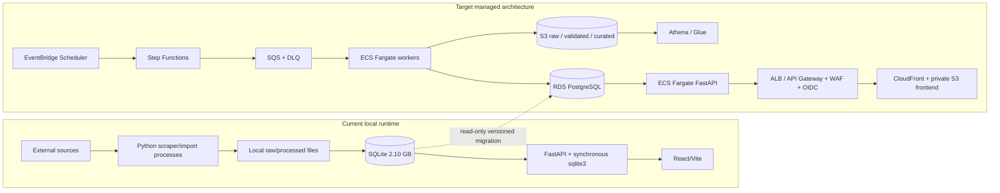

# AWS/PostgreSQL Target Architecture Contract

Status: Phase-0 design contract; no AWS resource has been created or changed.

## Current-to-target boundary



## Runtime request path

1. CloudFront serves immutable Vite assets from a private S3 origin.
2. API requests reach WAF and ALB/API Gateway.
3. OIDC establishes identity; application RBAC authorizes route/action.
4. ECS FastAPI uses bounded async SQLAlchemy/asyncpg sessions.
5. Interactive reads use normalized PostgreSQL tables and versioned materialisations.
6. Mutations use explicit transactions, idempotency keys and immutable audit events.
7. No request performs long scraping, full dataset rebuilds or local-file coordination.

## Batch and activation path

```mermaid
sequenceDiagram
    participant Scheduler as EventBridge / operator
    participant Orchestrator as Step Functions
    participant Queue as SQS / DLQ
    participant Worker as Fargate worker
    participant ObjectStore as Versioned S3
    participant Database as PostgreSQL

    Scheduler->>Orchestrator: start source ingestion run
    Orchestrator->>Queue: enqueue idempotent units
    Queue->>Worker: deliver bounded work
    Worker->>ObjectStore: write immutable raw object + checksum manifest
    Worker->>Database: load versioned staging rows
    Worker->>Database: write counts / quality issues / reconciliation
    alt reconciliation passes
      Orchestrator->>Database: transactionally activate dataset version
    else validation fails
      Orchestrator->>Database: reject candidate; preserve last active version
      Orchestrator->>Queue: send terminal work to DLQ where applicable
    end
```

## Data ownership

| Data class | System of record | Notes |
|---|---|---|
| Raw source payload/version | S3 | Immutable, checksum-addressed manifest, KMS, no public access. |
| Validated/curated historical files | S3 Parquet | Partitioned by dataset/source/time; lifecycle remains non-destructive initially. |
| Operational organizations/grants/relationships | PostgreSQL | Typed, constrained and transactionally versioned. |
| Search | PostgreSQL `tsvector`/GIN and optional `pg_trgm` | Deterministic ranking/tie-break and cursor behavior. |
| Interactive aggregates | PostgreSQL materialized/versioned tables | Built before dataset activation. |
| Broad historical analytics/reconciliation | Athena/Glue over S3 | Never substitutes for transactional/low-latency PostgreSQL. |
| Job/run/audit/governance state | PostgreSQL | Durable, queryable and not tied to an API process filesystem. |
| User identity | External OIDC provider | Only subject/claims needed for authorization/audit are stored. |

## Security boundaries

- Public: static frontend and explicitly classified read-only API routes.
- Authenticated: analyst/profile/news reads where source cost or data policy requires identity.
- Operator: queued manual refresh and controlled data-quality actions.
- Administrator: configuration, relink/reset, retention approval and privileged operational actions.
- Internal service: worker callbacks and queue-driven state changes using task identities, not user cookies.
- Proxy: disabled by default; fixed host/path/method/header allowlists only.
- RDS and workers remain in private subnets. Data buckets block public access. Secrets enter tasks through Secrets Manager/SSM and task roles.

## Failure and rollback contract

- A candidate dataset is never visible before reconciliation succeeds.
- The last approved dataset stays readable during failed ingestion/migration.
- Activation is one transaction changing the active dataset reference.
- Rollback reactivates the prior approved PostgreSQL dataset and preserves the rejected target for diagnosis.
- The coherent SQLite source remains read-only during the validation window; it is not a permanent production fallback.
- No bidirectional replay occurs without a separately approved conflict policy.

## Managed-service justification

ECS Fargate is the justified serverless-container exception for the API and long-running/bulk workers. Lambda is not selected for the 2.10 GB migration, source crawling, large materialisation builds or latency-sensitive API with pooled database connections. EventBridge, Step Functions, SQS/DLQ, S3, RDS, CloudWatch and managed identity/secrets supply the managed control/storage plane.
