# CI/CD and Protected Deployment Guide

Status: workflow definitions and local contracts complete; no workflow, GitHub
setting, OIDC exchange, AWS action, image push, Terraform plan/apply or staging
deployment has been executed.

## Pull request gate

`.github/workflows/ci.yml` has seven required workstreams and one aggregate
gate:

1. Backend hash-locked install, compile, blocking Flake8, mypy, tests and 70%
   coverage floor.
2. Frontend `npm ci`, lint, unit tests, production build/bundle budgets and
   Playwright/axe at all six viewports.
3. pip/npm vulnerability, licence and secret scanning.
4. Python/JavaScript CodeQL SAST.
5. Digest-pinned container build, CycloneDX SBOM, Trivy and non-root/size/
   no-data/health assertions.
6. Terraform offline contract, formatting, read-only provider locks,
   `init -backend=false`, validation and Trivy configuration scan.
7. Empty PostgreSQL Alembic migration, PostgreSQL integration, deterministic
   migration/reconciliation fixtures, API golden tests and pool/performance
   smoke.

Backend and frontend CycloneDX 1.5 SBOMs are generated deterministically from
the committed lockfiles. The committed evidence currently contains 70 Python
and 128 npm components. The local licence gate inspected 155 installed
components, found zero unknown declarations and no AGPL/SSPL/GPL declaration.

The Terraform job deliberately requires committed provider locks and uses
`-lockfile=readonly`. Those locks cannot be generated under the current
registry authorization, so the future GitHub required gate must remain
unconfigured or expected red until the Phase-11 blocker is resolved. This is
not represented as a passing remote CI run.

## Staging workflow

`.github/workflows/deploy-staging.yml` is manual-only and requires the exact
confirmation phrase `I_APPROVE_STAGING`. It uses no access-key inputs.

```mermaid
flowchart LR
  Manual[Manual confirmation] --> Build[Local candidate build + scans]
  Build --> PublishApproval[Protected staging-publish approval]
  PublishApproval --> OIDCPlan[OIDC publish by tag, resolve digest, plan]
  OIDCPlan --> Plan[Uploaded text + JSON + binary plan]
  Plan --> DeployApproval[Protected staging approval]
  DeployApproval --> Apply[Apply exact reviewed plan]
  Apply --> Alembic[Private one-off Alembic task]
  Alembic --> Services[Deploy API + workers by task definition]
  Services --> Frontend[Sync frontend + invalidate CloudFront]
  Frontend --> Gates[Smoke, load, reconcile, E2E, security, rollback readiness]
```

The application/worker services ignore task-definition drift in Terraform so
the reviewed infrastructure plan cannot move serving traffic before Alembic
passes. The workflow then updates the two services explicitly and waits for
stability. The private release-gate task verifies exact schema, one approved
active dataset, successful reconciliation, active analytics materialization,
no active quality block and an empty DLQ.

The workflow assumes an already approved/bootstraped staging foundation. A
first deployment needs a separately reviewed zero-capacity/bootstrap sequence;
the artefact deployment role is intentionally not an infrastructure-admin
bootstrap role.

## Required GitHub configuration

These settings are external blockers and have not been configured or read:

- Required checks for the aggregate PR gate and CodeQL/SARIF permissions.
- Protected environments `staging-publish`, `staging` and `production`, with
  independent required reviewers and no self-approval.
- OIDC plan/publish/deployment roles and exact repository/environment trust.
- Staging account/region, encrypted state bucket, lock table, Route53/ACM,
  API/frontend URL and repository variables.
- A short-lived staging test bearer token stored only in the protected
  environment secret store.
- Retention rules for plan, image, SBOM, SARIF and deployment evidence.

Action references use versioned upstream release tags because GitHub access
was not authorised to resolve and verify full action commit SHAs. Before
enabling required checks, resolve every action to a reviewed full commit SHA
and record the mapping; do not silently trust a moved tag.

## Rollback and production

Before apply, staging records the prior API and worker task-definition ARNs.
The gate proves they remain describable and the ECS deployment circuit breaker
is configured for rollback. Actual rollback is an explicit operator action
following the versioned rollback runbook; it is not silently performed from
an unapproved workflow.

`.github/workflows/deploy-production.yml` declares the protected production
environment but its only job is hard-disabled with `if: ${{ false }}`. It must
not be enabled until provider locks, remote CI, AWS/DNS/identity/owner/legal/
recovery approvals, staging evidence and an explicit production authorization
all exist.
