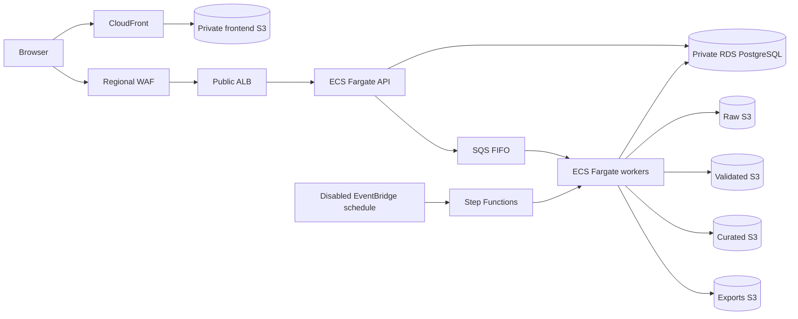
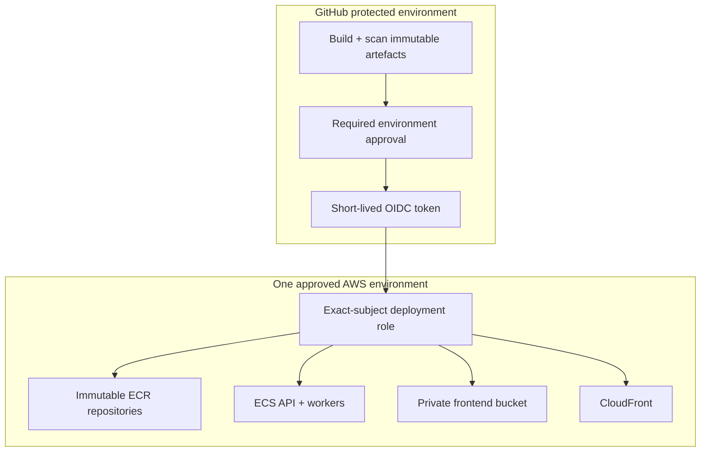
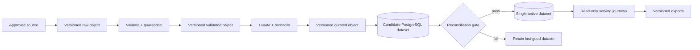
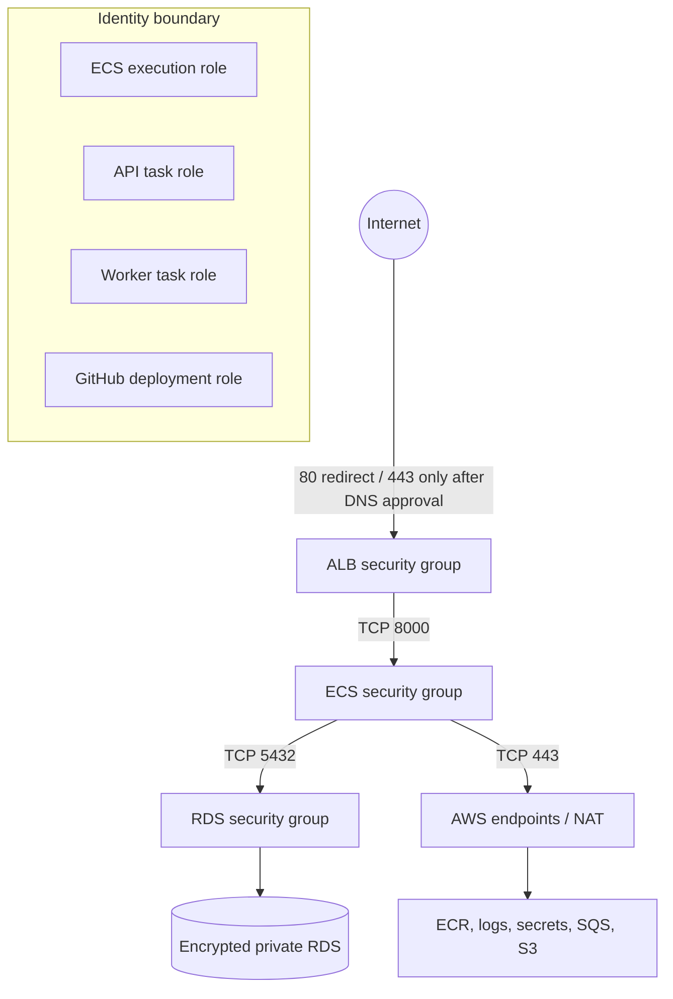

# Terraform AWS Infrastructure Contract

Status: implemented and offline-checked for development and staging. No AWS
API call, Terraform provider download, state access, plan or apply has occurred.

## Architecture



The ALB occupies public subnets only. API and workers have no public IP and
run in private application subnets. PostgreSQL occupies isolated private
database subnets with no internet route. Development uses one NAT gateway and
omits interface endpoints to cap fixed cost; staging uses one NAT per zone and
private ECR/logs/secrets/SQS endpoints. Both use the S3 gateway endpoint.

## Deployment topology



The role trust pins `aud=sts.amazonaws.com` and exactly
`repo:<owner>/<repository>:environment:<environment>`. No AWS access key is a
Terraform input. Infrastructure bootstrap/state ownership is deliberately not
granted to the artefact deployment role.

## Data flow



Every data bucket blocks public access, enforces bucket-owner ownership and
KMS encryption. Raw/validated/curated/export buckets are versioned. Lifecycle
rules only transition storage classes; no object or version expiration is
defined. Schedule state remains `DISABLED` in both environments.

## Security boundaries



Cross-tier rules reference security groups rather than CIDRs. RDS has no
public endpoint, is deletion-protected and has a Terraform `prevent_destroy`
guard. ECS tasks run as `10001:10001`, drop all Linux capabilities, use a
read-only root filesystem and accept only digest-addressed images. Database
credentials are generated by RDS, encrypted by KMS and injected from Secrets
Manager at runtime. Application code accepts the injected password without
writing a secret file.

The only wildcard IAM resources are AWS API necessities: ECR authorization,
KMS key policy scope, Step Functions log-delivery/task-observation APIs and
tag-constrained task-definition registration. No statement grants wildcard
actions. Bucket wildcard actions occur only in an explicit deny for insecure
transport.

## Environment profile and cost envelope

These are planning envelopes, not live AWS quotes or approved budgets. They
must be replaced with an approved AWS Pricing Calculator export before apply.

| Driver | Development assumption | Staging assumption |
|---|---:|---:|
| RDS PostgreSQL | Single-AZ `db.t4g.small`, 30–100 GiB | Multi-AZ `db.t4g.medium`, 100–500 GiB |
| NAT | One gateway, low transfer | One per AZ, production-like transfer |
| Fargate | One 0.5-vCPU API + one worker | Two 0.5-vCPU API + two workers, autoscaling |
| Endpoints | S3 gateway only | S3 plus ECR/logs/secrets/SQS endpoints |
| Logs/metrics | 30-day logs, low ingest | 90-day logs, container insights and higher ingest |
| S3/Athena | Limited fixtures; Athena usage not provisioned | Versioned data; Athena scans remain optional/unapproved |
| CloudFront/WAF/ALB | Low request volume | Pre-production request/load-test volume |
| Data transfer | Low | Moderate; source and E2E tests dominate |
| Estimated monthly range | USD 180–300 | USD 550–900 |
| Proposed budget alarm | USD 300 | USD 750 |

The largest uncertain drivers are NAT bytes, RDS Multi-AZ/runtime, Fargate
worker duty cycle, CloudWatch log cardinality/retention, S3 volume/class
transitions, optional Athena scans, WAF requests, CloudFront egress and
cross-AZ/data-transfer traffic.

## DNS, ACM and state configuration points

`manage_dns=false` is the default and is fixed in both examples. Enabling it
requires an approved domain and Route53 zone ID; Terraform then defines DNS
validation, an ACM certificate, HTTPS listener and ALB alias. No DNS or
certificate action has been executed. CloudFront uses its AWS TLS hostname
until a separately reviewed us-east-1 edge certificate/DNS alias is approved.

No remote backend is declared. An approved operator must separately define
the state account, encrypted/versioned state bucket, lock mechanism, recovery
owner and bootstrap procedure. This repository must not create or mutate that
state foundation under the current authorization.

## Validation and deployment boundary

The offline validation command is:

```zsh
PYTHONPATH=src venv/bin/python scripts/validate_terraform_static.py
PYTHONPATH=src venv/bin/python -m pytest -q src/tests/test_terraform_contract.py
```

Once Terraform/provider downloads and an isolated non-AWS validation context
are approved, run for each environment:

```zsh
terraform fmt -recursive infra/terraform
terraform fmt -check -recursive infra/terraform
terraform -chdir=infra/terraform/environments/staging init -backend=false
terraform -chdir=infra/terraform/environments/staging validate
```

Only after separate approval for AWS read access and safe plan credentials:

```zsh
terraform -chdir=infra/terraform/environments/staging plan -refresh=false -lock=false -input=false -var-file=terraform.tfvars -out=reviewed.tfplan
terraform -chdir=infra/terraform/environments/staging show -json reviewed.tfplan
```

Do not run `apply`, `destroy`, `import`, state mutation, DNS changes or a real
plan under the current authorization. The example image/account values are
non-deployable placeholders and all schedules remain disabled.
